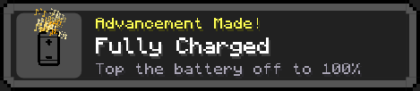

# Advancemint 🏆

minecraft-style **"Advancement Made!"** toasts for stuff your pc actually does. stay up
past 2am? achievement. open discord? achievement. battery hits 100%? achievement. push
your cpu to 90%? achievement. ~55 of them, and they just fire while you live your life.

works on **windows and linux**.



## what it does

- pops a real minecraft advancement toast (top-right, gold particle burst, chime) when
  you unlock something
- **~55 achievements** across time, system, apps, media and meta
- tray icon with a live **Achievements: X / 55** counter, a **Show progress** window
  (unlocked in color, locked greyed out), test toast, and reset
- **start with windows / start on login** toggle
- progress saves to `%APPDATA%\Advancemint` (win) or `~/.config/advancemint` (linux)

## some of the achievements

| | |
|---|---|
| 🦉 **Night Owl** | be up and about after 2 AM |
| 🌙 **All-Nighter** | still going between 4 and 6 AM |
| 🛌 **Ultramarathon** | 8 hours of uptime. go to bed. |
| 💥 **System Meltdown** | cpu and ram both over 85% at once |
| 🪫 **Danger Zone** | let the battery drop to 15% |
| 💎 **Diamonds!** | open task manager |
| 🦴 **Museum Trip** | launch BONELAB |
| 🎚️ **Resident DJ** | play 10 different songs |
| 🌃 **Just One More Song** | playing music after midnight |
| 🌌 **The End?** | unlock every other achievement |

plus linux-only ones: 🐧 **Penguin Power**, ⏱️ **Uptime Warrior** (24h), 🗿 **Never Reboot**
(7 days), 🏋️ **Load Bearing**, and KDE app ones (konsole, dolphin, kate).

## grab it

**windows:** download the `.exe` from [Releases](../../releases). self-contained, no .NET
install, just double click. it's unsigned so smartscreen may whine, hit More info then
Run anyway.

**linux:** download the tarball from [Releases](../../releases), then:

```bash
tar -xzf advancemint-linux-x64.tar.gz
cd advancemint
./advancemint
```

optional, for the music achievements: `sudo apt install playerctl`

## build it yourself

you need the [.NET 10 SDK](https://dotnet.microsoft.com/download) (windows) or .NET 9+
(linux), plus the assets (see below).

```bash
# windows
dotnet publish -c Release -r win-x64 --self-contained true -p:PublishSingleFile=true -p:IncludeNativeLibrariesForSelfExtract=true -p:EnableCompressionInSingleFile=true

# linux (cross-compiles from windows too)
cd linux
dotnet publish -c Release -r linux-x64 --self-contained true
```

## assets

the minecraft font/textures aren't in this repo, they're Mojang's, not mine to hand out.
drop your own into `assets/` (and `linux/assets/`) with these names:

| file | what it is |
|---|---|
| `Monocraft.ttf` | the font ([free/OFL, grab it here](https://github.com/IdreesInc/Monocraft)) |
| `now_playing.png` | the toast panel background (160×32 minecraft toast) |
| `music_notes.png` | note sprite sheet (16×128, eight 16×16 frames) for the particle burst |

`icon.png` / `icon.ico` (the star) and `advancement.wav` (the chime) are mine and already
included.

## how it works

a poll loop every 3 seconds reads what's going on and checks it against every locked
achievement.

- **windows:** SMTC for media, plus Win32 for battery / idle / windows / foreground app
- **linux:** MPRIS via playerctl for media, plus `/proc/stat`, `/proc/meminfo` and
  `/sys/class/power_supply`

windows is **WPF**, linux is **Avalonia**. the toast is the same nine-sliced minecraft
panel + Monocraft either way.

heads up: linux drops the idle/AFK, focused-app and window-count achievements, because
wayland (rightly) won't let a random app snoop on your windows. it gets the linux-only
ones above instead.

## license

[MIT](LICENSE) for my code. minecraft assets you supply are Mojang's and covered by their
terms, not this license.
